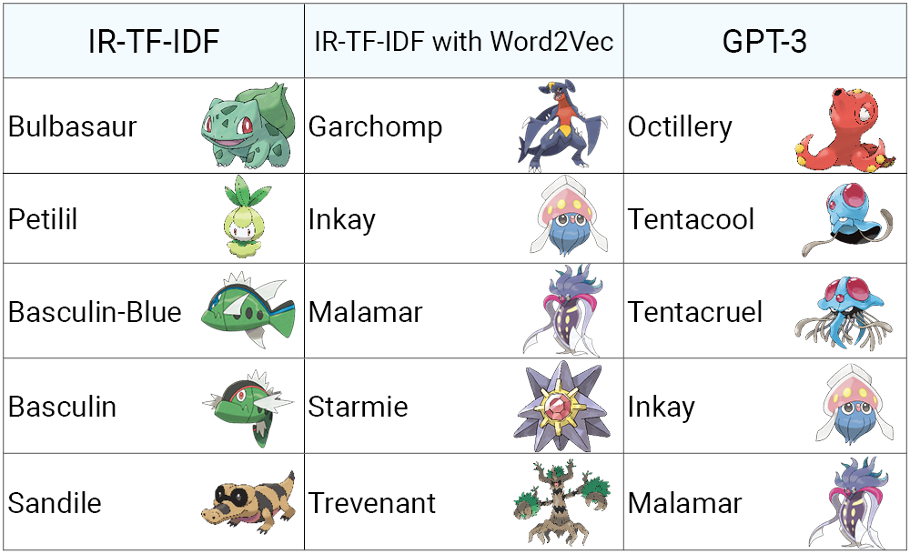

# 
Reverse Dictionary with Video Game Characters

### 
Kaitlyn Chan

### 
<a href="https://github.com/k6chan/reverse-dictionary-pokemon">GitHub Repository</a>

## Topic

Creating a web app for users to query characters in the Pokemon video game series using a choice of baseline and neural network weakly-supervised natural language processing (NLP) models.

## Set up the Demo with Docker

The web app demo's server can be run as a Docker image with the following command: <code>docker run -it --rm -p 5000:5000 k6chan/reverse-dictionary-pokemon:latest</code>.

## Background

### Natural Language Processing and Reverse Dictionaries

Natural language processing (NLP) is a rapidly developing field with recent applications including weakly supervised text classification that uses machine learning techniques to label documents with minimal human intervention.

The conventional dictionary data structure is a collection of key-value pairs. When given a key, a dictionary returns the value. Meanwhile, reverse dictionaries are given a value and return the key. Reverse dictionaries are useful for tip-of-the-tongue problems where one may not recall the name of an object, instead only having a few descriptors instead. Hence, a user can query these descriptors and receive the names of the best-matching objects.

Reverse dictionaries are simple to implement if the query exactly matches or contains the dictionary definition, but in reality a user may not provide such a perfect match. NLP allows for a more realistic model to be implemented where the user’s description can be used to intelligently search for the top most likely names.

### *Pokemon*

Video game franchises, notably collectible monster franchises like *Pokemon* can have hundreds of characters each with distinct characteristics, making a reverse dictionary a helpful way to query specific Pokemon based on their appearance and statistics from the games.

This reverse dictionary web app is created for people to reconnect with a series that they enjoy, in this case the long-running *Pokemon* franchise.

Data on each Pokemon was web-scraped from <a href="https://www.smogon.com/">Smogon University</a> and <a href="https://bulbapedia.bulbagarden.net/wiki/Main_Page">Bulbapedia</a> for this project.

## Methods

Available models on the web app return the top 5 most similar Pokemon to the user's query.

### IR-TF-IDF

A baseline method that does not require human supervision is Term-Frequency-Inverse-Document Frequency when used for information retrieval (IR-TF-IDF). This model uses counting to return the Pokemon whose collected data contains the most matches to the user's query: When adapted for text classification, IR-TD-IDF aggregates the TF-IDF values of its seed words (in this context, the user’s query) as they appear in a given document (a Pokemon in the dataset) and returns the Pokemon with the greatest aggregate TF-IDF.

IR-TF-IDF is a fast and simple model, however it cannot return accurate results whenever the user's query contains words that can't be matched to any word in the collected data.

### Word2Vec and IR-TF-IDF with Word2Vec

Word2Vec is a neural network that creates vector representations of words. It creates a vector representing each Pokemon and compares these to the vector representing the user's query. The Pokemon whose vectors have the highest similarity to the user's query are returned by this model. However, due to insufficient collected data and the narrow scope of the Pokemon franchise, this model does not return accurate results.

Instead, a Word2Vec model pre-trained on Wikipedia is used to suggest similar words to the user's query. The user's query, in addition to these similar words, are then fed into an IR-TF-IDF model. This way, words close to but not initially in the user's query can also be searched for in the collected data.

This model has mixed results, seen in the Results section table.

### GPT-3

GPT-3 is a large neural network trained on massive datasets including Wikipedia and the Web as a whole. It is used as a question-answer model that can even serve as a reverse dictionary for Pokemon. It does not use the collected data from this project. As the GPT-3 API requires paid credit, it is not available on the web app.

## Results

As IR-TF-IDF relies on counting and matching the exact words from the user’s query to each Pokemon, it will fail to return any similar Pokémon when the user’s query does not contain words found in any Pokemon's collected data.

Standalone Word2Vec models failed to produce accurate results, that is, any Pokemon matching the user's query. Instead, it was incorporated into an IR-TF-IDF model.

GPT-3 showed impressive and reasonable results after fine-tuning the question asked to the model.

A comparison between the baseline IR-TF-IDF, IR-TF-IDF with Word2Vec, and GPT-3 models is provided in the table below. When given a query whose words do not exist in the collected data (“octopus”), IR-TF-IDF provides the default result, IR-TF-IDF with Word2Vec does not return an octopus Pokémon but instead includes a squid and starfish Pokémon, and GPT-3 with its outside data sources is finally able to return an octopus Pokémon.

</img>

## Conclusion

A reverse dictionary for a particular domain such as a video game series is an engaging method for people to reconnect with a series they enjoy. It is useful for solving tip-of-the-tongue problems where only a few descriptors of a character are known, as it can return numerous possible matches sorted by confidence.

The data collected is sufficient for baseline models and some neural networks to provide accurate results, however the latter requires more robust descriptions of each character from a variety of sources in order to cover as much of the narrow domain as possible. Extensions to this paper include additional models on the web app, more data collection from Bulbapedia such as behavior and role in the story or games. GPT-3 can be asked to provide additional descriptors on each Pokémon. Other NLP models will also benefit from sentence structure being considered and contained within the data.

## Tools

* Web scraping: Beautiful Soup 4
* Data and query preprocessing: spaCy
* Word2Vec and Doc2Vec models: gensim
* Web app server: Flask